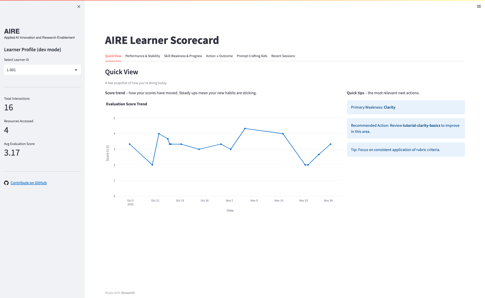
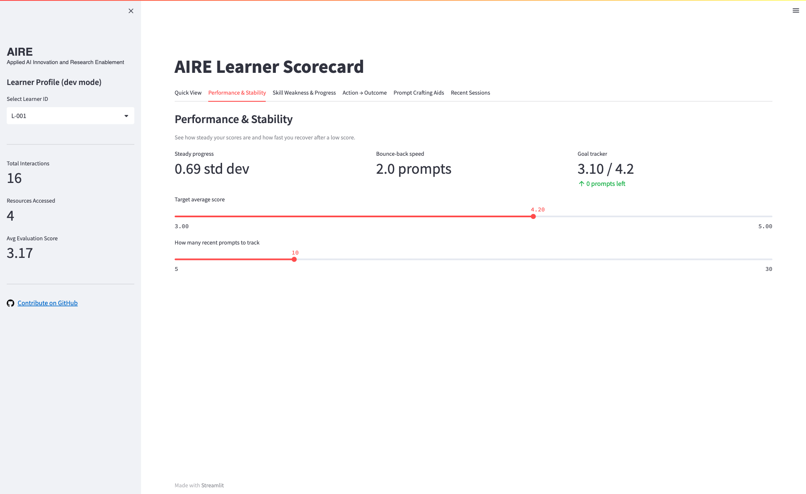
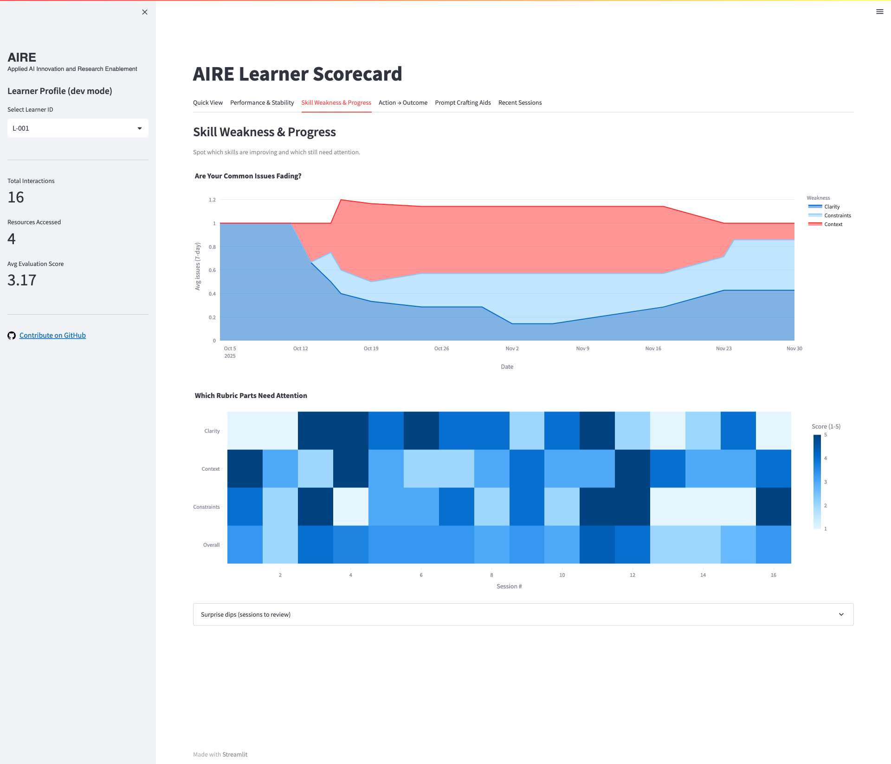
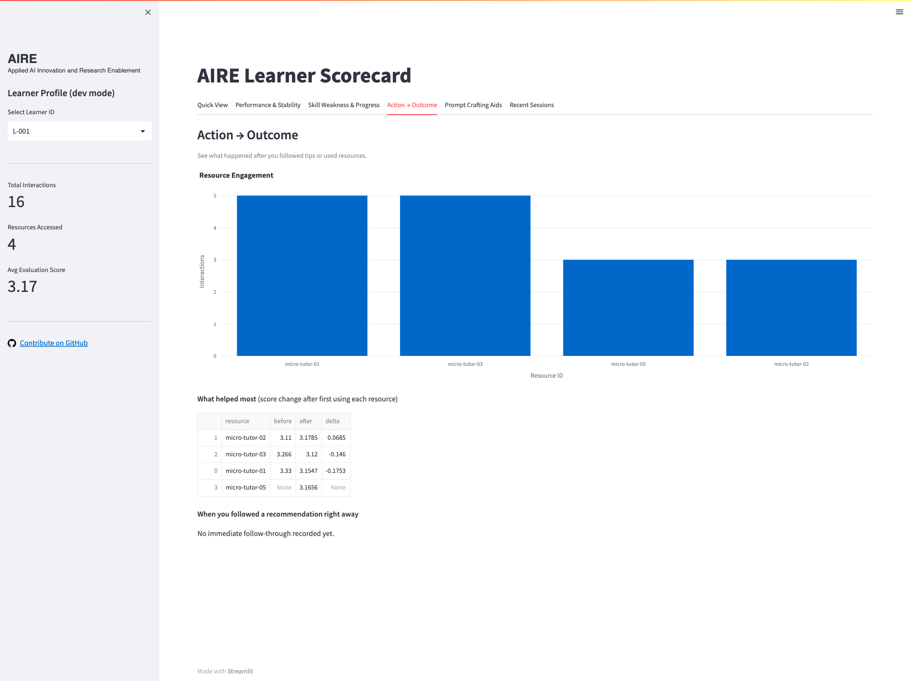
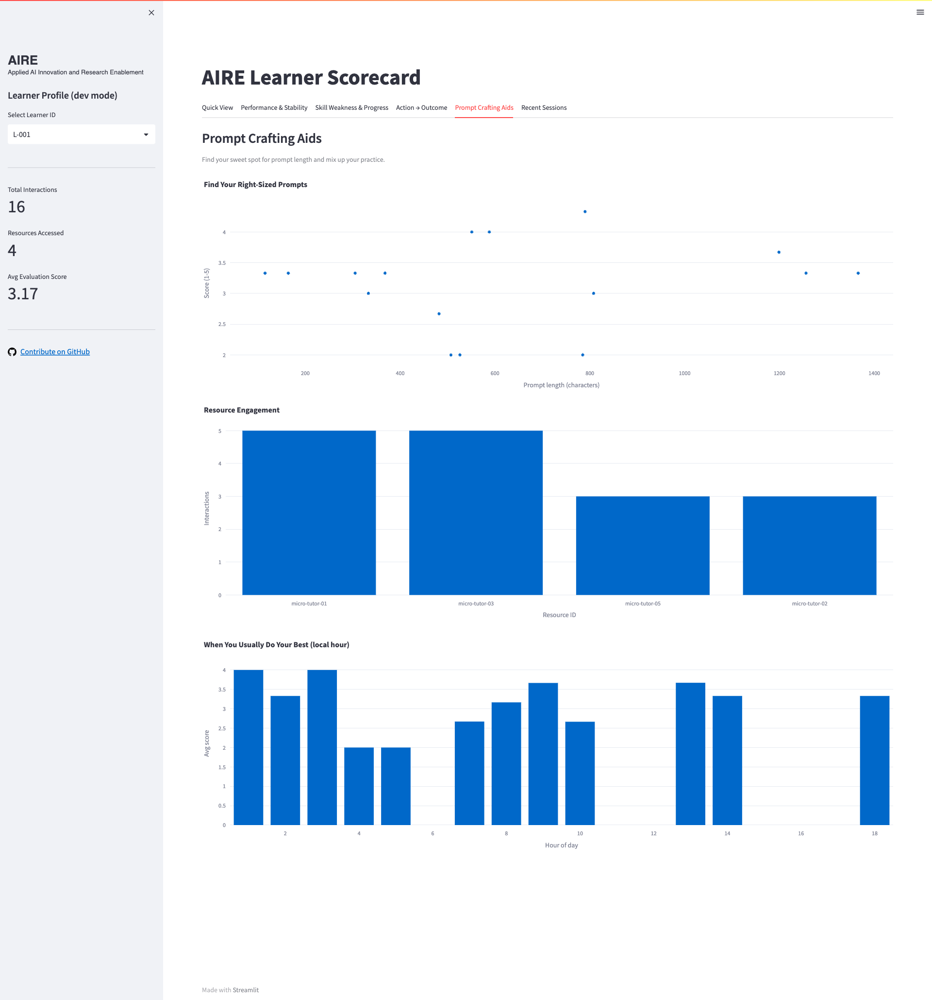
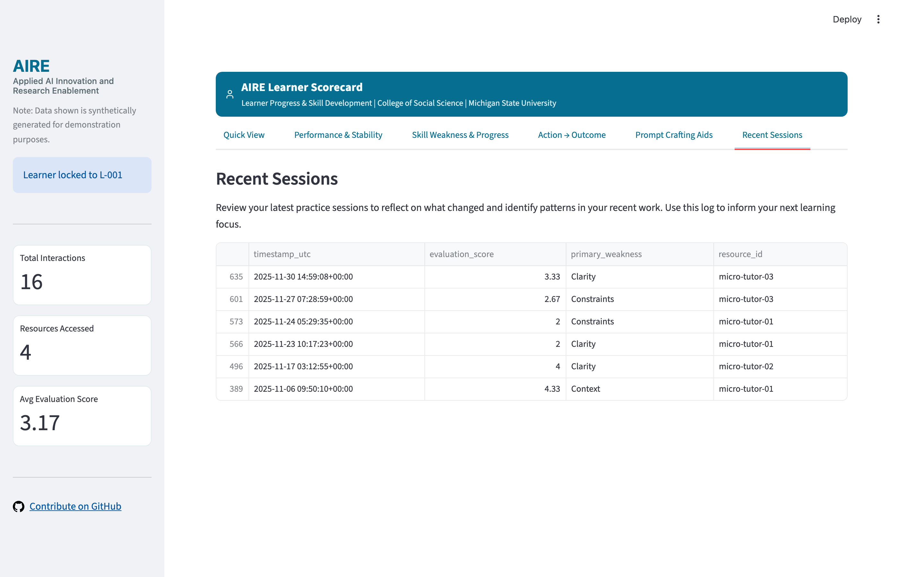

# AIRE Learner Scorecard  

The AIRE Learner Scorecard is part of the Personalization Layer of the Applied AI Innovation and Research Enablement (AIRE) Program. It provides learner-facing analytics that summarize how individuals are using AI prompting within the AIRE Researcher Sandbox and how their skills change over time. The public version in this repository mirrors the structure and logic of the internal MSU deployment while relying entirely on synthetic data.

The Scorecard helps learners move beyond one-off AI interactions toward more intentional and reflective practice. By presenting simple, interpretable views of prompt-quality indicators and patterns, it supports thoughtful use of AI tools in teaching, learning, and research contexts.

## Role in the AIRE Ecosystem

The AIRE Program includes four coordinated components:

- AIRE Literacy Hub  
- AIRE Researcher Sandbox  
- AIRE Impact Dashboard  
- AIRE Personalization Layer (Micro Tutor and Learner Scorecard)

Within this structure, the AIRE Learner Scorecard serves as the learner-facing analytics tool in the Personalization Layer. It is designed to help individuals:

- observe changes in their prompting practices over time  
- review prompt-quality scores related to clarity, context, constraints, and evaluation instructions  
- identify recurring strengths and recurring weaknesses  
- understand how often they engage with different Sandbox workflows  
- see suggested areas for further practice and exploration  

In the internal MSU deployment, the Scorecard drew on authenticated telemetry generated as learners interacted with the AIRE Micro Tutor and Sandbox notebooks. This public version uses synthetic data that follows the same schema so that the approach can be studied, adapted, or extended without exposing any real learner information.

## Screenshots

### Quick View


### Performance & Stability


### Skill Weakness & Progress


### Action → Outcome


### Prompt Crafting Aids


### Recent Sessions


## Public Version and Data Approach

All data in this repository is synthetic and has been generated specifically to demonstrate the Scorecard’s structure and analytic views. The synthetic dataset is intended to:

- show how prompt-level feedback can be summarized in a simple dashboard  
- illustrate basic patterns in evaluation scores and common weaknesses  
- provide a concrete example of how learner-facing analytics can be designed in an AI literacy program  

Institutions, research groups, or instructional design teams may replace the synthetic dataset with their own telemetry, provided that use remains aligned with local policy, ethics review, and data governance requirements.

## Setup and Usage

To run the AIRE Learner Scorecard locally:

1. Install dependencies  

   From the repository root, run:  

       pip install -r requirements.txt  

2. Generate synthetic telemetry data  

   Run the synthetic data generation script:  

       python3 scripts/generate_synthetic_telemetry.py  

   This will create a file named:  

       data/aire_telemetry_synthetic.csv  

3. Launch the Scorecard dashboard  

   Start the Streamlit application:  

       streamlit run app.py  

   Once running, open the provided local URL in your browser to explore the Scorecard views.

## Data Schema

The synthetic telemetry dataset follows the standard AIRE telemetry schema. The core fields include:

- `timestamp_utc` – the time the interaction occurred  
- `learner_id` – an anonymized identifier for the learner  
- `resource_id` – the related Sandbox resource or notebook  
- `evaluation_score` – a numerical score (for example 1 to 5) reflecting overall prompt quality  
- `primary_weakness` – a categorical description of the main area for improvement (for example clarity, context, constraints, or evaluation instructions)  
- `recommended_resource_id` – an identifier linking to a suggested next resource or workflow  

This schema is intentionally simple so that it can be adapted to different local contexts or extended with additional fields if needed.

## Relationship to the AIRE Micro Tutor

The AIRE Micro Tutor provides prompt-level, rubric-based feedback inside the AIRE Researcher Sandbox notebooks. In the internal deployment, each interaction generated telemetry records that could be summarized in the Scorecard. The Scorecard then presented these records as:

- trend lines for evaluation scores  
- counts of common weaknesses  
- engagement summaries by resource  
- suggested areas for continued practice  

In the public version, the synthetic dataset takes on the role of these telemetry records. The workflows and views remain faithful to the original design so that the approach can be examined and adapted by others.

## Contributing and Adaptation

Contributions that improve clarity, extend example data, or add new analytic views are welcome. Institutions or teams that wish to adapt the Scorecard for their own programs may:

- adjust the synthetic data generation script  
- modify the schema to reflect local feedback categories or scoring models  
- redesign views to align with specific reporting needs  

Before using real learner data, implementers should ensure alignment with institutional policies, ethics review processes, and data governance requirements.

## Development

### Project Structure
- `app.py`: Main Streamlit application.
- `src/`: Shared logic and schema definitions.
- `scripts/`: Data generation scripts.
- `tests/`: Unit tests.
- `data/`: Directory for generated data.

### Running Tests
This project uses `pytest` for testing. To run the test suite:

```bash
pytest tests/
```

### Code Style
The project follows standard Python coding conventions. Type hints are used throughout the codebase to ensure clarity and maintainability.
